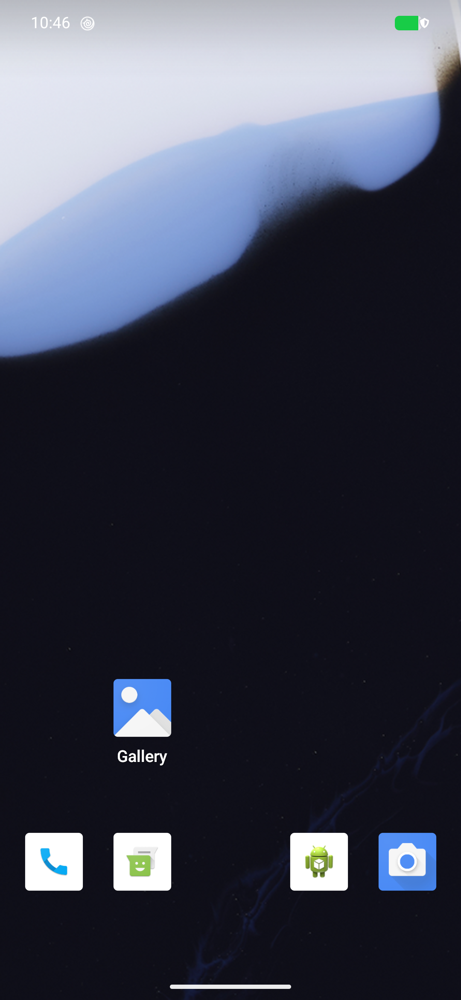
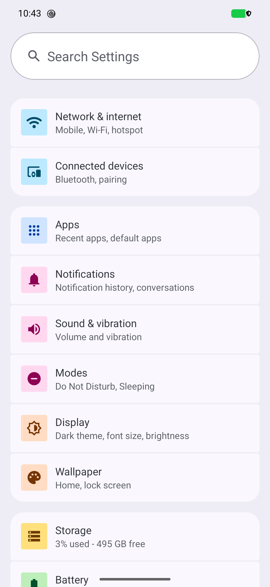
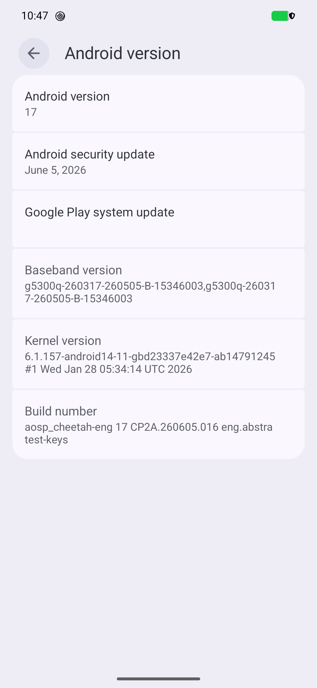

<!--
Copyright 2026 Terrance Leverette (AbstractsRevenge)
Sovereign Lane Surgeon: https://github.com/AbstractsRevenge/Sovereign_Lane_Surgeon

Licensed under the Apache License, Version 2.0 (the "License");
you may not use this file except in compliance with the License.
You may obtain a copy of the License at

     http://www.apache.org/licenses/LICENSE-2.0

Unless required by applicable law or agreed to in writing, software
distributed under the License is distributed on an "AS IS" BASIS,
WITHOUT WARRANTIES OR CONDITIONS OF ANY KIND, either express or implied.
See the License for the specific language governing permissions and
limitations under the License.
-->

# Evidence

What is claimed elsewhere in this wiki, with the artifacts behind it. Everything here is
reproducible from the repository; nothing is a summary of a summary.

## Continuous integration

[](https://github.com/AbstractsRevenge/Sovereign_Lane_Surgeon/actions/workflows/ci.yml)

Every push runs the suite on a clean machine. A test count in a README is a claim; a run someone
else can inspect is evidence, so the badge is the number that matters. Three things it proves that
no prose can:

- the bundle committed to git matches the manifests committed beside it, file by file;
- a **real device seed** runs end to end from that bundle into a temporary tree, and the result
  passes the same structural checks `create -stock` runs on itself;
- the slim `-tags nobundle` build still compiles, so the distribution path is not quietly broken.

The suite also fails when the documentation drifts from the code, or when an authored file is
missing its licence header.

## The ROM running

The build, on the phone, photographed from the phone. Two screens, each proving something the
other cannot.

### It is an AOSP build, not a repackaged Google one



AOSP's own launcher, and AOSP's own applications: Phone, Messaging, Gallery, Camera. No search
bar, no Play Store, no Google Mobile Services anywhere. A Pixel running Google's shipping android-17
does not look like this. This is what a build from source looks like when it reaches the launcher.

### Settings runs, and the system behind it is complete



Settings is the application most sensitive to a broken system image: every category on that
screen is a framework service answering. Network, Bluetooth, apps, notifications, sound, display
and storage all report, and storage reads 3% used of 512 GB, which means the formatted userdata
partition and the encryption layer beneath it came up correctly on the first boot after the wipe.

### It is android-17, from this source, on the factory kernel



Everything the toolkit does is legible on one screen:

| Field | Value | What it shows |
|---|---|---|
| Android version | 17 | the target release |
| Build number | `aosp_cheetah-eng 17 CP2A.260605.016 eng.abstra test-keys` | an **AOSP engineering build**, from source, test-keys — not Google's `user`/`release-keys` image |
| Kernel version | `6.1.157-android14-11-gbd23337e42e7-ab14791245` | the kernel **out of the factory image**, assembled into the prebuilt directory the release names. AOSP never published this build |
| Baseband | `g5300q-260317-260505-B-15346003` | Google's radio firmware, which the vendor blobs require |

That combination is the whole thesis: a system built from AOSP source, running on the vendor
partition, kernel and firmware taken from Google's factory image, on hardware whose device tree
android-17 does not ship.

The same facts from the device, without a screenshot in the way:

```
ro.build.fingerprint         Android/aosp_cheetah/cheetah:17/CP2A.260605.016/eng.abstra:eng/test-keys
ro.vendor.build.fingerprint  google/cheetah/cheetah:17/CP2A.260705.006/15641320:user/release-keys
```

An AOSP system fingerprint beside a Google release vendor fingerprint, on one device.

Measured on that boot:

| | |
|---|---|
| adb available | 21 s |
| boot completed | 48 s |
| SELinux | enforcing |
| /data | encrypted |
| verified boot | orange (bootloader unlocked, as required to flash) |
| vendor, vendor_dlkm | mounted through dm-verity |
| hardware services registered | 75 |

## An image measured before flashing

`preflight` output for husky, the first zuma image, comparing the built images against the factory
image they derive from:

```
PASS images          boot dtbo vendor_boot vbmeta vbmeta_system init_boot vendor_kernel_boot pvmfw + super.img
PASS kernel          6.1.157-android14-11-gbd23337e42e7-ab14791245
PASS super-layout    system(1055M) system_dlkm(11M) system_ext(423M) product(409M) vendor(858M) vendor_dlkm(24M)
PASS super-coverage  holds every partition of the factory layout: product system system_dlkm system_ext vendor vendor_dlkm
PASS super-fit       google_dynamic_partitions_a 2782M/8132M
PASS vbmeta-coverage verifies every factory-verified partition it builds: boot dtbo init_boot vbmeta_system
                     vbmeta_vendor vendor_boot vendor_dlkm vendor_kernel_boot
PASS android-info    require version-baseband=g5300i-260317-260505-B-15346003; require version-bootloader=ripcurrent-17.0-15199481
PASS vendor-glue     proprietary/BoardConfigVendor.mk present (BOARD_PREBUILT_VENDORIMAGE reaches the build)
VERDICT: FLASHABLE as far as the images can tell
```

Note the last three words. This measures files, not behaviour; see [[Verification]] for what it
cannot see.

## Bundle fidelity

```
$ sovereign-lane-surgeon bundle audit -source /path/to/android-15.0.0_r36
  32 directories, 9671 entries compared, 36 excluded by design
  OK — content, executable bits, symlinks and empty directories all match
  ! 2 of 34 directories were not audited — no -source tree carries them: device/google/tegu device/google/tegu-sepolicy
      device/google/tegu came from android-15.0.0_r31
VERDICT: no divergence in the 32 directories audited; 2 unaudited (source tree not provided)
```

The unaudited pair is reported rather than assumed. A directory whose source is not on hand is not
a pass.

## Build records

Every build runs through AOSP Build Capture, whose run directory is named for its verdict, so the
result cannot be restated more favourably than it happened. Run identifiers for every device are
in [CURRENT_STATE.md](https://github.com/AbstractsRevenge/Sovereign_Lane_Surgeon/blob/main/CURRENT_STATE.md).

The failures are recorded there too, including the two that cost 46 and 25 minutes before they
were understood. They are more informative than the successes.
