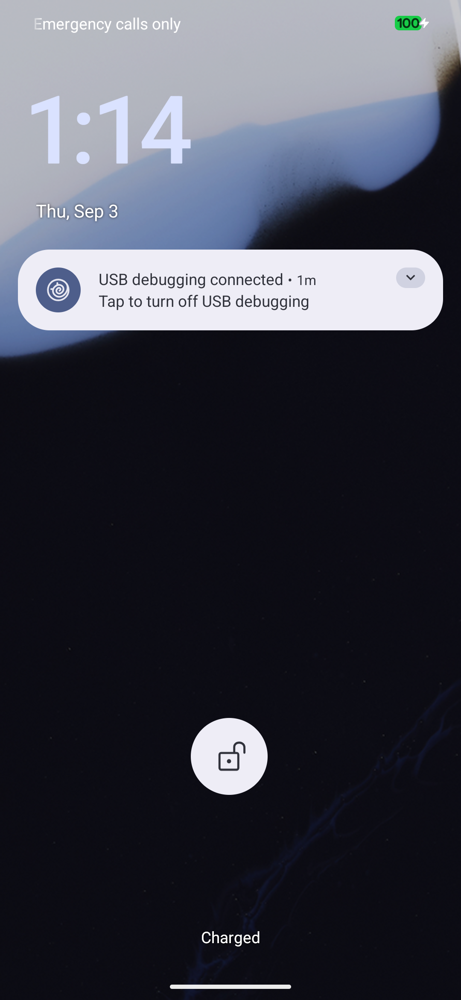

<!--
Copyright 2026 The Android Open Source Project
Copyright 2026 Sovereign Lane Surgeon

Licensed under the Apache License, Version 2.0 (the "License");
you may not use this file except in compliance with the License.
You may obtain a copy of the License at

     http://www.apache.org/licenses/LICENSE-2.0

Unless required by applicable law or agreed to in writing, software
distributed under the License is distributed on an "AS IS" BASIS,
WITHOUT WARRANTIES OR CONDITIONS OF ANY KIND, either express or implied.
See the License for the specific language governing permissions and
limitations under the License.
-->

# Evidence

What is claimed elsewhere in this wiki, with the artifacts behind it. Everything here is
reproducible from the repository; nothing is a summary of a summary.

## Continuous integration

[](https://github.com/AbstractsRevenge/sovereign_lane_surgeon/actions/workflows/ci.yml)

Every push runs the suite on a clean machine. A test count in a README is a claim; a run someone
else can inspect is evidence, so the badge is the number that matters. Three things it proves that
no prose can:

- the bundle committed to git matches the manifests committed beside it, file by file;
- a **real device seed** runs end to end from that bundle into a temporary tree, and the result
  passes the same structural checks `create -stock` runs on itself;
- the slim `-tags nobundle` build still compiles, so the distribution path is not quietly broken.

The suite also fails when the documentation drifts from the code, or when an authored file is
missing its licence header.

## The boot

A Pixel 7 Pro running an image this toolkit seeded, built and flashed. Second proof, on the super
image the build produced itself rather than one assembled afterwards.



A lock screen looks like any other lock screen, so it proves little alone. This is what makes it
evidence:

```
ro.build.fingerprint         Android/aosp_cheetah/cheetah:17/CP2A.260605.016/eng.abstra:eng/test-keys
ro.vendor.build.fingerprint  google/cheetah/cheetah:17/CP2A.260705.006/15641320:user/release-keys
```

The system side is an **AOSP engineering build, signed with test keys**, built from source on a
workstation. The vendor side is **Google's release vendor image**, user build, release keys. Those
two halves running together on one phone is the entire point of the toolkit, and it is not
something a screenshot alone could show.

Measured on that boot:

| | |
|---|---|
| adb available | 21 s |
| boot completed | 48 s |
| SELinux | enforcing |
| /data | encrypted |
| verified boot | orange (bootloader unlocked, as required to flash) |
| vendor, vendor_dlkm | mounted through dm-verity |
| hardware services registered | 75 |

## An image measured before flashing

`preflight` output for husky, the first zuma image, comparing the built images against the factory
image they derive from:

```
PASS images          boot dtbo vendor_boot vbmeta vbmeta_system init_boot vendor_kernel_boot pvmfw + super.img
PASS kernel          6.1.157-android14-11-gbd23337e42e7-ab14791245
PASS super-layout    system(1055M) system_dlkm(11M) system_ext(423M) product(409M) vendor(858M) vendor_dlkm(24M)
PASS super-coverage  holds every partition of the factory layout: product system system_dlkm system_ext vendor vendor_dlkm
PASS super-fit       google_dynamic_partitions_a 2782M/8132M
PASS vbmeta-coverage verifies every factory-verified partition it builds: boot dtbo init_boot vbmeta_system
                     vbmeta_vendor vendor_boot vendor_dlkm vendor_kernel_boot
PASS android-info    require version-baseband=g5300i-260317-260505-B-15346003; require version-bootloader=ripcurrent-17.0-15199481
PASS vendor-glue     proprietary/BoardConfigVendor.mk present (BOARD_PREBUILT_VENDORIMAGE reaches the build)
VERDICT: FLASHABLE as far as the images can tell
```

Note the last three words. This measures files, not behaviour; see [[Verification]] for what it
cannot see.

## Bundle fidelity

```
$ sovereign-lane-surgeon bundle audit -source /path/to/android-15.0.0_r36
  32 directories, 9671 entries compared, 36 excluded by design
  OK — content, executable bits, symlinks and empty directories all match
  ! 2 of 34 directories were not audited — no -source tree carries them: device/google/tegu device/google/tegu-sepolicy
      device/google/tegu came from android-15.0.0_r31
VERDICT: no divergence in the 32 directories audited; 2 unaudited (source tree not provided)
```

The unaudited pair is reported rather than assumed. A directory whose source is not on hand is not
a pass.

## Build records

Every build runs through AOSP Build Capture, whose run directory is named for its verdict, so the
result cannot be restated more favourably than it happened. Run identifiers for every device are
in [CURRENT_STATE.md](https://github.com/AbstractsRevenge/sovereign_lane_surgeon/blob/main/CURRENT_STATE.md).

The failures are recorded there too, including the two that cost 46 and 25 minutes before they
were understood. They are more informative than the successes.
